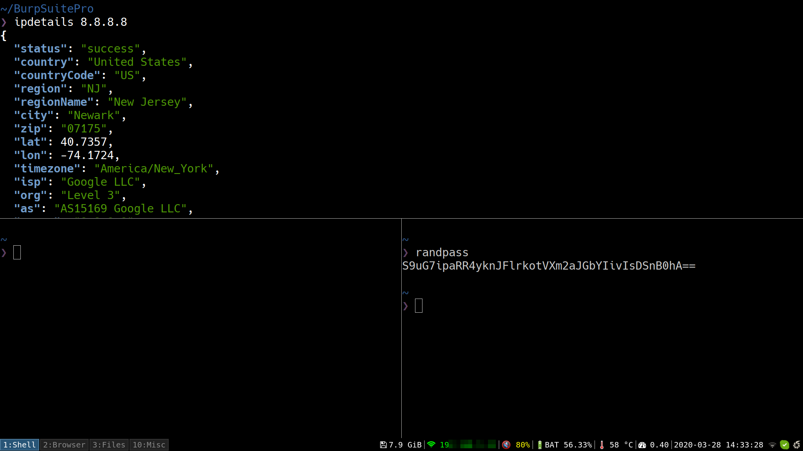

# dotfiles

A collection of personal laptop dotfiles. 

## The setup 

- Laptop: Dell XPS 13 9350
- OS: Debian
- Window manager: i3wm
- Terminal: Terminator
- Shell: zsh

## How is the repo updated?

I'm using a bare git repo technique to sync this repo with my dotfiles on the laptop. The method is explained here https://www.atlassian.com/git/tutorials/dotfiles

## Screenshots

